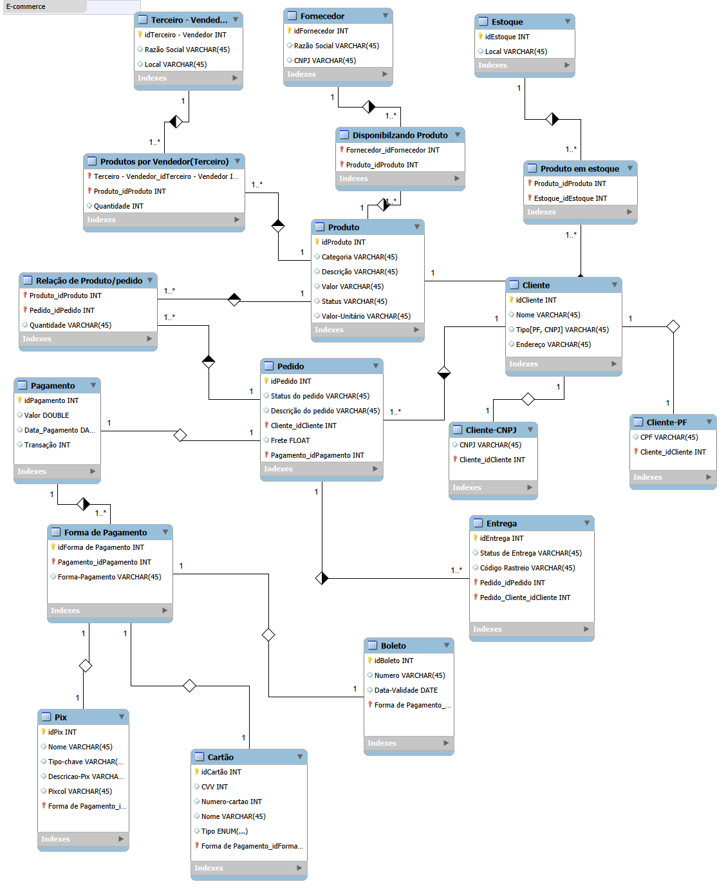

 #**Modelagem de Banco de Dados para E-commerce**

 ###Este projeto apresenta o modelo de dados para um ecossistema de e-commerce, abrangendo desde a gestão de clientes (PF/PJ) e pagamentos até o controle de estoque e fornecedores.

 

 ##Destaques da Modelagem:

 **Especialização de Clientes:** Diferenciação entre Pessoa Física (CPF) e Pessoa Jurídica (CNPJ).

**Gestão de Estoque:** Relacionamento entre produtos, fornecedores e estoques locais.

**Fluxo de Pagamento:** Suporte a múltiplas formas de pagamento (Pix, Boleto, Cartão).

**Logística:** Rastreamento de pedidos e status de entrega.